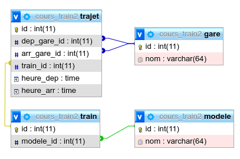

# Exercice : Trains

Le travail est à réaliser à partir du fichier disponible à l’adresse suivante :
[Exercice-Trains.sql](Exercice-Trains.sql)

Une fois ce fichier téléchargé, vous l’importerez dans une nouvelle base de données.

### Contexte

Votre client possède un réseau de chemin de fer et une base de données.

<figure>
  
  <figcaption>Figure 1 – Le diagramme représentant la base MySQL de votre application.</figcaption>
</figure>

#### Voici les informations du réseau de votre client :

- Cinq gares : Paris, Lyon, Marseille, Toulouse et Lille.
- Trois modèles de trains : TGV, TER et Fret.
- 12 trains : 4 de modèle TGV, 4 de modèle TER et 4 de modèle Fret.
- Les 12 trajets suivants :

  | Départ          | Arrivée         | Catégorie de train |
  | --------------- | --------------- | ------------------ |
  | Paris 02:00     | Lille 08:00     | TER                |
  | Paris 09:00     | Lyon 19:00      | TER                |
  | Paris 03:00     | Marseille 14:00 | TER                |
  | Lyon 15:00      | Marseille 23:00 | TER                |
  | Marseille 13:00 | Toulouse 18:00  | TGV                |
  | Marseille 16:00 | Lille 21:00     | TGV                |
  | Toulouse 10:00  | Lille 22:00     | TGV                |
  | Toulouse 05:00  | Paris 19:00     | TGV                |
  | Lille 04:00     | Marseille 00:00 | Fret               |
  | Lille 01:00     | Lyon 17:00      | Fret               |
  | Lyon 06:00      | Paris 12:00     | Fret               |
  | Lyon 07:00      | Lille 20 :00    | Fret               |

---

## Question 1

Écrivez une requête qui retourne les noms des différents types de train.

## Question 2

Écrivez une requête qui retourne les `ID` des trajets dont l’heure de départ est plus grande que l’heure d’arrivée (le train arrive le jour suivant).

## Question 3

Écrivez une requête qui retourne les heures d’arrivée et les noms des villes correspondantes.

## Question 4

Écrivez une requête qui retourne pour chaque ville son nom et le nombre de trajets au départ de cette ville, dans l’ordre décroissant du nombre de départs.

## Question 5

Écrivez une requête qui retourne pour chaque ville son nom et le nombre de trajets à l’arrivé de cette ville, dans l’ordre croissant du nombre d’arrivées.

## Question 6

Pour chaque trajet afficher le nom de la gare de départ, heure de départ, heure d'arrivée et le nom de la gare d'arrivée.

## Question 7

Écrivez une requête qui retourne tous les trajets et leur durée. Pour cela il vous faudra utiliser les instructions `CASE`, `TIMEDIFF()` et `ADDTIME()`.

<!--
## Question 6 (Bonus)

Écrivez une requête qui retourne l’ID du trajet en TGV le plus rapide.

Info : il vous faudra utiliser la fonction `MIN()`, la fonction `TIMEDIFF()` et un `SELECT` imbriqué.

SELECT
	id_trajet,
	CASE
    	WHEN `heure_arrivee` > `heure_depart` THEN
        	timediff(`heure_arrivee`,`heure_depart`)
        ELSE
        	timediff(`heure_depart`, `heure_arrivee`)
    END
        AS delay

FROM
	trajet
    JOIN train ON (trajet.id_train = train.id_train)
    JOIN modele ON (modele.id_modele = train.id_modele)
WHERE modele.nom = 'TGV'
ORDER BY delay ASC
-->
