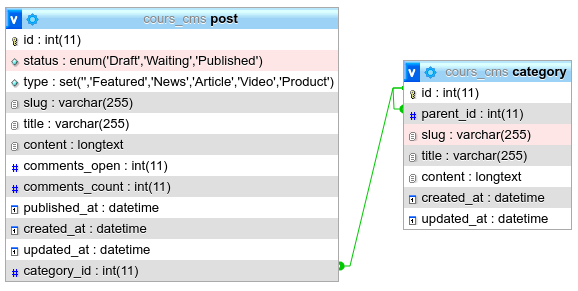
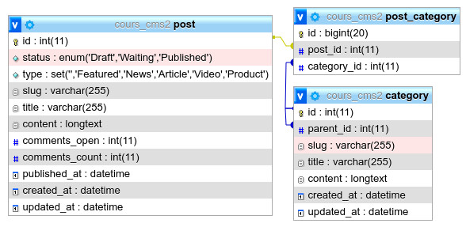
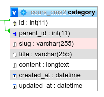

# Cours MySql - Initiation

## Base de Données Relationnelle et Transactionnelle (RDBMS)

Le language standard pour dialoguer avec une base de données est le SQL

> L’abréviation SQL signifie «&thinsp;Structured Query Language&thinsp;», un langage informatique servant à l’administration de structures de bases de données. Les opérations possibles comprennent des requêtes, des insertions, mises à jour et suppressions de fichiers de données.

### Principaux produits disponibles

- Open Source

  - **MySql**

    Logiciel développé par la société suédoise MySQL AB en 1994 est désormais sous le patronage d’Oracle Corporation et est distribué sur la base d’un système de double licence. En dehors de la version propriétaire entreprise, Oracle offre une licence GPL open source.<br>
    _Note personnelle&thinsp;: MySql est devenu un piège à pigeons&thinsp;! (Au demeurant très lucratif pour Oracle.)_

  - **MariaDB**

    Dès 2009, l’équipe de développement et le fondateur de MySQL Michael Monty Widenius tournait le dos au populaire système de base de données et a lancé le fork à source ouverte MariaDB. Fin 2012, Fedora, OpenSUSE, Slackware et Arch Linux présentaient les premières distributions Linux pour passer de MySQL à MariaDB comme installation standard. De nombreux projets open source, ainsi que les sociétés de logiciels bien connus et plateformes Web ont suivi cet exemple, à l’image de Mozilla, Ubuntu, Google, Red Hat Entreprise Linux, Web of Trust, TeamSpeak, la fondation Wikimedia ainsi que le projet de logiciels XAMPP.<br>
    MariaDB se caractérise déjà par un développement continu, en comparaison avec d’autres systèmes MySQL open source. Il est donc probable que ce fork dépasse un jour son projet-mère.
    Note personnelle : si vous envisagez le développement d'une grosse application (nombreuse tables, nombreuses liaisons, usage de GROUP BY sur de grosses tables), MariaDB hérite de tous les points faibles de MySql et vous décevra. PostgreSQL est 500x plus performant, bien plus robuste, c'est un outil professionnel. MySql, c'est pour faire du vite "torché", son point fort est phpMyAdmin qui vous permet gérer votre base de données au "click-o-drôme".

    - points forts : phpMyAdmin, hébergement bon marché, beaucoup de code près à l'emploi disponible en php. Parfait pour débuter.
    - points faibles :
      - 63 tables max. dans une requête. En fait ses performances se dégradent grandement dès qu'il y a de nombreuses jointures.
      - MySQL gère très mal les GROUP BY.
      - Nombreuses limitations sur la taille des index qui dans le cas du utf8mb4 se rencontrent facilement : champ VARCHAR(191) en mb4 est la limite pour les index.

  - **PostgreSQL**

    A ce jour, elle reste la base de donnée la plus robuste disponible. Les plus grandes bases de données mondiales sont sous PostgreSQL (Yahoo).

    Toutefois sa mise en route et le déploiement d'applications apportent un surcoût (serveur dédié).

  - **SQLite**

    A la différence des BD évoquées ci-dessus, elle ne fonctionne pas sur une architecture client/serveur.

    SQLite n'a besoin que d'un simple fichier pour stocker une base de données. En conséquence elle ne gère pas les accès concurrentiels, c'est "chacun son tour" pour obtenir un vérrou d'écriture.

    Vous l'utilisez tous les jours : historique de votre navigateur, carnet d'adresse de votre téléphone portable, etc...

    Elle peut être utilisée comme base de donnée locale à l'intérieur même du navigateur (javascript) ou coté serveur. Elle est souvent utilisée pour les phases de développement lorsqu'on utilise un ORM (une représentation objet de la base de donnée).

- **Closed Source**

  - **Oracle**

    Leader du marché et très puissant, toutefois les licences sont très coûteuses. (L'édition entreprise est à 37 492 € HT par processeur - 2015)

  - **SQL Server (MS SQL)**

    Sur le papier est presque comparable à PostgreSQL mais en pratique son coût ne justifie pas son seul avantage, le GUI.

    Notons que Microsoft interdit la publication de benchmark visant à comparer les performances de son produit face à la concurrence... Je crois que tout est dit.

---

## Modélisation

### Relation modèles 1 à n



### Relation modèles n à n



### Représentation d'un arbre (arborescence)



### Le GRAPH

```sql
CREATE TABLE `point` (
  id int,
  `name` VARCHAR(64),
  lat FLOAT,
  lng FLOAT
)

CREATE TABLE simple_graph (
  start_point_id int,
  end_point_id int,
  path_id int,
);
```

---

## SQL

### Présentation de SQL

SQL signifie "Structured Query Language" c'est-à-dire "Langage d'interrogation structuré".
En fait SQL est un langage complet de gestion de bases de données relationnelles. Il a été conçu par IBM dans les années 70. Il est devenu le langage
standard des systèmes de gestion de bases de données (SGBD) relationnelles
(SGBDR).
C'est à la fois :

- un langage d'<a href="#interrogation-de-la-base-select">interrogation de la base (ordre SELECT)</a>
- un langage de <a href="#manipulation-des-données-update-insert-delete">manipulation des données (LMD ; ordres UPDATE, INSERT, DELETE)</a>
- un langage de <a href="#définitions-des-données">définition des données</a> (LDD ; ordres CREATE, ALTER, DROP),
- un langage de contrôle de l'accès aux données (LCD ; ordres GRANT, REVOKE).

Le langage SQL est utilisé par les principaux SGBDR : DB2, Oracle, Informix, Ingres, RDB,... Chacun de ces SGBDR a cependant sa propre variante du langage. Ce support de cours présente un noyau de commandes
disponibles sur l'ensemble de ces SGBDR,

### Normes SQL

SQL a été normalisé dès 1986 mais les premières normes, trop incomplètes, ont été ignorées par les éditeurs de SGBD.

La norme SQL2 (appelée aussi SQL92) date de 1992. Le niveau est à peu près respecté par tous les SGBD relationnels qui dominent actuellement le marché.

SQL-2 définit trois niveaux :

- Full SQL (ensemble de la norme)
- Intermediate SQL
- Entry Level (ensemble minimum à respecter pour se dire à la norme SQL-2)

SQL3 (appelée aussi SQL99) est la nouvelle norme SQL.
Malgré ces normes, il existe des différences non négligeables entre les syntaxes et fonctionnalités des différents SGBD. En conséquence, écrire du code portable n'est pas toujours simple dans le domaine des bases de données.

### Identificateurs

SQL utilise des identificateurs pour désigner les objets qu'il manipule : utilisateurs, tables, colonnes, index, fonctions, etc...

Un identificateur est un mot formé d'au plus 30 caractères, commençant obligatoirement par une lettre de l'alphabet.

Les caractères suivants peuvent être une lettre, un chiffre, ou l'un des symboles # $ et \_.

**SQL ne fait pas la différence entre les lettres minuscules et majuscules. (Mais MySQL sous linux oui!!! Alors que sous windows non.)**

Les voyelles accentuées ne sont pas acceptées. (Même si MySQL les acceptent, évitez absolument!)

Un identificateur ne doit pas figurer dans la liste des mot clés réservés. Voici quelques mots clés que l'on risque d'utiliser comme identificateurs : ASSERT, ASSIGN, AUDIT, COMMENT, DATE, DECIMAL, DEFINITION, FILE, FORMAT, INDEX, LIST, MODE, OPTION, PARTITION, PRIVILEGES, PUBLIC, REF, REFERENCES, SELECT, SEQUENCE, SESSION, SET, TABLE, TYPE, NAME...

Voir la liste complète : [MariaDB Reserved Words](https://mariadb.com/kb/en/reserved-words/)

Avec MySQL les mots réservés sont employés comme nom d'un identificateur (table, champ, base de données, etc...) sont "échapés" avec l'apostrophe inversé `

Exemple :

```sql
CREATE TABLE `user` (
  id SERIAL,
  `name` VARCHAR(255)
);
```

### Tables

Les relations (d'un schéma relationnel) sont stockées sous forme de tables composées de lignes et de colonnes.

Il est d'usage (mais non obligatoire évidemment) de mettre les noms de table au singulier : plutôt EMPLOYE que EMPLOYES pour une table d'employés.

Table DEPT des départements :

| DEPT | NOM         | LIEU     |
| ---- | ----------- | -------- |
| 10   | FINANCES    | PARIS    |
| 20   | RECHERCHE   | GRENOBLE |
| 30   | VENTE       | LYON     |
| 40   | FABRICATION | ROUEN    |

### Colonnes

Les données contenues dans une colonne doivent être toutes d'un même type de données. Ce type est indiqué au moment de la création de la table qui contient la colonne.
Chaque colonne est repérée par un identificateur unique à l'intérieur de chaque table. Deux colonnes de deux tables différentes peuvent porter le même nom. Il est ainsi fréquent de donner le même nom à deux colonnes de deux tables différentes lorsqu'elles correspondent à une clé étrangère à la clé primaire référencée.

Une colonne peut porter le même nom que sa table.

Le nom complet d'une colonne est en fait celui de sa table, suivi d'un point et du nom de la colonne. Par exemple, la colonne `DEPT.LIEU`

Le nom de la table peut être omis quand il n'y a pas d'ambiguïté sur la table à laquelle elle appartient, ce qui est généralement le cas.

## Types de données

[Documentation officielle MariaDB (en)](https://mariadb.com/kb/en/data-types/)

La version française est très incomplète.

### Types numériques

Les types numériques sont :

- Nombres entiers : SMALLINT (sur 2 octets, de -32.768 à 32.767), INTEGER (sur 4 octets, de -2.147.483.648 à 2.147.483.647), BIGINT (sur 8 octets, de -9 milliards de milliards à +9).

  Exemples

  ```sql
  CREATE TABLE ints (a INT,b INT UNSIGNED,c INT ZEROFILL);
  ```

  With strict_mode set, the default from MariaDB 10.2.4:

  ```sql
  INSERT INTO ints VALUES (-10,-10,-10);
  -- ERROR 1264 (22003): Out of range value for column 'b' at row 1

  INSERT INTO ints VALUES (-10,10,-10);
  -- ERROR 1264 (22003): Out of range value for column 'c' at row 1

  INSERT INTO ints VALUES (-10,10,10);

  INSERT INTO ints VALUES (2147483648,2147483648,2147483648);
  -- ERROR 1264 (22003): Out of range value for column 'a' at row 1

  INSERT INTO ints VALUES (2147483647,2147483648,2147483648);

  SELECT * FROM ints;
  +------------+------------+------------+
  | a          | b          | c          |
  +------------+------------+------------+
  |        -10 |         10 | 0000000010 |
  | 2147483647 | 2147483648 | 2147483648 |
  +------------+------------+------------+
  ```

- Nombres décimaux avec un nombre fixe de décimales : NUMERIC, DECIMAL (la norme impose à NUMERIC d'être implanté avec exactement le nombre de décimales indiqué alors que l'implantation de DECIMAL peut avoir plus de décimales) : DECIMAL(p, d) correspond à des nombres décimaux qui ont p chiffres significatifs et d chiffres après la virgule ; NUMERIC a la même syntaxe.

  Examples

  ```sql
  CREATE TABLE t1 (d DECIMAL UNSIGNED ZEROFILL);

  INSERT INTO t1 VALUES (1),(2),(3),(4.0),(5.2),(5.7);
  -- Query OK, 6 rows affected, 2 warnings (0.16 sec)
  -- Records: 6  Duplicates: 0  Warnings: 2

  -- Note (Code 1265): Data truncated for column 'd' at row 5
  -- Note (Code 1265): Data truncated for column 'd' at row 6

  SELECT * FROM t1;
  +------------+
  | d          |
  +------------+
  | 0000000001 |
  | 0000000002 |
  | 0000000003 |
  | 0000000004 |
  | 0000000005 |
  | 0000000006 |
  +------------+
  ```

  ```sql
  CREATE TABLE t2 (salaire DECIMAL(8,2) UNSIGNED);
  -- Query OK, 0 rows affected (0.020 sec)

  INSERT INTO t2 VALUES (1),(2),(3),(4.0),(5.2),(5.7);
  -- Query OK, 6 rows affected (0.007 sec)
  -- Records: 6  Duplicates: 0  Warnings: 0


  SELECT * FROM t2;
  +---------+
  | salaire |
  +---------+
  |    1.00 |
  |    2.00 |
  |    3.00 |
  |    4.00 |
  |    5.20 |
  |    5.70 |
  +---------+
  ```

- Numériques non exacts à virgule flottante : REAL (simple précision, avec au moins 7 chiffres significatifs), DOUBLE PRECISION ou FLOAT (double précision, avec au moins 15 chiffres significatifs). (SQL-2)

  La définition des types non entiers dépend du SGBD (le nombre de chiffres significatifs varie). Reportez-vous au manuel du SGBD que vous utilisez pour plus de précisions.

  En l'occurrence, avec MariaDB tout est inversé!

  FLOAT = Single pression

  REAL = Double pression

  Dans MariaDB tous les calculs internes son effectués en DOUBLE, il est préférable d'utiliser REAL pour éviter les surprises.

  Exemple

  ```sql
  CREATE TABLE t1 (d DOUBLE(5,0) zerofill);

  INSERT INTO t1 VALUES (1),(2),(3),(4);

  SELECT * FROM t1;
  +-------+
  | d     |
  +-------+
  | 00001 |
  | 00002 |
  | 00003 |
  | 00004 |
  +-------+
  ```

- Le type BIT permet de ranger une valeur booléenne (un bit) en SQL-2.

  Exemples

  ```sql
  CREATE TABLE b ( b1 BIT(8) );
  -- With strict_mode set, the default from MariaDB 10.2.4:

  INSERT INTO b VALUES (b'11111111');

  INSERT INTO b VALUES (b'01010101');

  INSERT INTO b VALUES (b'1111111111111');
  -- ERROR 1406 (22001): Data too long for column 'b1' at row 1

  SELECT b1+0, HEX(b1), OCT(b1), BIN(b1) FROM b;
  +------+---------+---------+----------+
  | b1+0 | HEX(b1) | OCT(b1) | BIN(b1)  |
  +------+---------+---------+----------+
  |  255 | FF      | 377     | 11111111 |
  |   85 | 55      | 125     | 1010101  |
  +------+---------+---------+----------+
  ```

### Types chaîne de caractères

- **CHAR(n)**

  Chaîne de longueur fixe qui est toujours complétée à droite avec des espaces jusqu'à la longueur spécifiée lorsqu'elle est stockée. M représente la longueur de la colonne en caractères. La plage de M va de 0 à 255. Si M est omis, la longueur est de 1.

  Les colonnes CHAR (0) peuvent contenir 2 valeurs : une chaîne vide ou NULL. Ces colonnes ne peuvent pas faire partie d'un index.

- **VARCHAR(n)**

  Equivalences :

  ```sql
  VARCHAR(30) CHARACTER SET utf8
  NATIONAL VARCHAR(30)
  NVARCHAR(30)
  NCHAR VARCHAR(30)
  NATIONAL CHARACTER VARYING(30)
  NATIONAL CHAR VARYING(30)
  ```

  Espaces de fin (Trailing spaces) :

  ```sql
  CREATE TABLE strtest (v VARCHAR(10));
  INSERT INTO strtest VALUES('Maria   ');

  SELECT v='Maria',v='Maria   ' FROM strtest;
  +-----------+--------------+
  | v='Maria' | v='Maria   ' |
  +-----------+--------------+
  |         1 |            1 |
  +-----------+--------------+

  SELECT v LIKE 'Maria',v LIKE 'Maria   ' FROM strtest;
  +----------------+-------------------+
  | v LIKE 'Maria' | v LIKE 'Maria   ' |
  +----------------+-------------------+
  |              0 |                 1 |
  +----------------+-------------------+
  ```

  Avec MariaDB le maximum est VARCHAR(65532) mais attention, l'index ne pourra pas dépasser 191 caractères en utf8mb4.

  > InnoDB Limitations
  >
  > MariaDB imposes a row-size limit of 65,535 bytes for the combined sizes of all columns. If the table contains BLOB or TEXT columns, these only count for 9 - 12 bytes in this calculation, given that their content is stored separately.

  La différence principale entre `VARCHAR()` et `TEXT` repose sur le fait que `VARCHAR()` peut être pleinement indexé.

- **TEXT / MEDIUMTEXT / LONGTEXT**

  Une colonne `TEXT` avec une longueur maximum de 65,535 (2<sup>16</sup> - 1) caractères (65k).

  `MEDIUMTEXT` est une colonne `TEXT` avec une longueur de 16MB (2<sup>24</sup> - 1) caractères. (coût 3 bytes)

  `LONGTEXT` est une colonne `TEXT` avec une longueur de 4GB (2<sup>32</sup> - 1) caractères. (coût 4 bytes)

- **BLOB / MEDIUMBLOB / LONGBLOB**

  Un `BLOB` est un objet binaire de taille variable.

- **ENUM()**

  Syntaxe :

  ```
  ENUM('value1','value2',...) [CHARACTER SET charset_name] [COLLATE collation_name]
  ```

  Index numérique

  Les valeurs ENUM sont indexées numériquement dans l'ordre dans lequel elles sont définies, et le tri sera effectué dans cet ordre numérique. Nous suggérons de ne pas utiliser ENUM pour stocker des chiffres, car il y a peu ou pas d'avantage d'espace de stockage, et il est facile de confondre l'entier d'énumération avec la valeur numérique d'énumération en omettant les guillemets.

  Un ENUM défini comme ENUM ('apple', 'orange', 'pear') aurait les valeurs d'index suivantes :

  | Index | Value    |
  | ----- | -------- |
  | NULL  | NULL     |
  | 0     | ''       |
  | 1     | 'apple'  |
  | 2     | 'orange' |
  | 3     | 'pear'   |

  Exemple

  ```sql
  CREATE TABLE fruits (
    id INT NOT NULL auto_increment PRIMARY KEY,
    fruit ENUM('apple','orange','pear'),
    bushels INT
  );

  DESCRIBE fruits;
  +---------+-------------------------------+------+-----+---------+----------------+
  | Field   | Type                          | Null | Key | Default | Extra          |
  +---------+-------------------------------+------+-----+---------+----------------+
  | id      | int(11)                       | NO   | PRI | NULL    | auto_increment |
  | fruit   | enum('apple','orange','pear') | YES  |     | NULL    |                |
  | bushels | int(11)                       | YES  |     | NULL    |                |
  +---------+-------------------------------+------+-----+---------+----------------+

  INSERT INTO fruits
      (fruit,bushels) VALUES
      ('pear',20),
      ('apple',100),
      ('orange',25);

  INSERT INTO fruits
      (fruit,bushels) VALUES
      ('avocado',10);
  -- ERROR 1265 (01000): Data truncated for column 'fruit' at row 1

  SELECT * FROM fruits;
  +----+--------+---------+
  | id | fruit  | bushels |
  +----+--------+---------+
  |  1 | pear   |      20 |
  |  2 | apple  |     100 |
  |  3 | orange |      25 |
  +----+--------+---------+
  ```

  Exemple de différence avec PostgreSQL

  ```sql
  CREATE TABLE students (
    id INT NOT NULL auto_increment PRIMARY KEY,
    full_name VARCHAR(128),
    gender ENUM('M','F')
  );

  INSERT INTO students (full_name, gender)
    VALUES
      ('Michael Jackson', 'M'),
      ('Bruce Lee', 'M'),
      ('Agatha Christie', 'F'),
      ('Marie Curie', 'F');

  -- MariaDB
  SELECT * FROM students WHERE gender > 'M';
  -- Empty set (0.000 sec)

  -- PostgreSQL
  SELECT * FROM students WHERE gender > 'M';
   id |    full_name    | gender
  ----+-----------------+--------
    3 | Agatha Christie | F
    4 | Marie Curie     | F
  (2 lignes)

  ```

- **SET()**

  Fonctionne un peut sur le même principe que `ENUM()` à la différence qu'un champ `ENUM` n'acceptera qu'une seule valeur, alors que `SET` peut en accepter plusieurs.

  <!--
    > A vérifier :
    > Il fonctionne comme un filtre de valeurs acceptables sur un champ texte, et je ne crois pas qu'il profite pas des optimisations qu'apporte le type `ENUM`.
  -->

  ```sql
  CREATE TABLE set_test (
    attrib SET('bold','italic','underline')
  );

  INSERT INTO set_test (attrib) VALUES ('bold');
  INSERT INTO set_test (attrib) VALUES ('bold,italic');
  INSERT INTO set_test (attrib) VALUES ('bold,italic,underline');

  SELECT * FROM set_test WHERE FIND_IN_SET('italic', attrib);
  +-----------------------+
  | attrib                |
  +-----------------------+
  | bold,italic           |
  | bold,italic,underline |
  +-----------------------+


  SELECT * FROM set_test WHERE attrib = 'bold';
  +--------+
  | attrib |
  +--------+
  | bold   |
  +--------+

  SELECT * FROM set_test WHERE attrib LIKE '%bold%';
  +-----------------------+
  | attrib                |
  +-----------------------+
  | bold                  |
  | bold,italic           |
  | bold,italic,underline |
  +-----------------------+

  SELECT * FROM set_test WHERE attrib = 'italic';
  -- Empty set (0.000 sec)
  ```

### Date et Heures

- **DATE**

  The date type YYYY-MM-DD.

- **TIME**

  Time format HH:MM:SS.ssssss

- **DATETIME**

  Date and time combination displayed as YYYY-MM-DD HH:MM:SS.

- **TIMESTAMP**

  ```
  TIMESTAMP [(microsecond precision)]
  ```

  TIMESTAMP (6)

  YYYY-MM-DD HH:MM:SS.ffffff

### Valeur NULL

Une colonne qui n'est pas renseignée, et donc vide, est dite contenir la valeur `NULL`. Cette valeur n'est pas zéro, c'est une absence de valeur.

Toute expression dont au moins un des termes a la valeur NULL donne comme résultat la valeur `NULL`.

Une exception à cette règle est la fonction `COALESCE`.
`COALESCE (expr1, expr2,...)` renvoie la première valeur qui n'est pas null parmi les valeurs des expressions
expr1, expr2,...

Elle permet de remplacer la valeur null par une autre valeur.

### Fonctions / Expressions

```sql
LIKE
SELECT 'This is a string' LIKE '%ing';
+--------------------------------+
| 'This is a string' LIKE '%ing' |
+--------------------------------+
|                              1 |
+--------------------------------+

TRIM() LTRIM() RTRIM()
SELECT TRIM(TRAILING 'xyz' FROM 'barxxyz');
+-------------------------------------+
| TRIM(TRAILING 'xyz' FROM 'barxxyz') |
+-------------------------------------+
| barx                                |
+-------------------------------------+

LCASE() UCASE()
LENGTH()
SUBSTRING()
REGEXP()
```

#### Fonctions d'aggrégation

Documentation officielle https://mariadb.com/kb/en/aggregate-functions/

##### COUNT()

```sql
CREATE TABLE student (name CHAR(10), test CHAR(10), score INT);

INSERT INTO student VALUES
  ('Chun', 'SQL', 75), ('Chun', 'Tuning', 73),
  ('Esben', 'SQL', 43), ('Esben', 'Tuning', 31),
  ('Kaolin', 'SQL', 56), ('Kaolin', 'Tuning', 88),
  ('Tatiana', 'SQL', 87), ('Tatiana', 'Tuning', 83);

SELECT COUNT(*) FROM student;
+----------+
| COUNT(*) |
+----------+
|        8 |
+----------+

-- COUNT(DISTINCT) example:

SELECT COUNT(DISTINCT (name)) FROM student;
+------------------------+
| COUNT(DISTINCT (name)) |
+------------------------+
|                      4 |
+------------------------+

-- Dans une fonction de fenêtre (window function)
SELECT name, test, score,
  COUNT(score) OVER (PARTITION BY name) AS tests_written
FROM student_test;
+---------+--------+-------+---------------+
| name    | test   | score | tests_written |
+---------+--------+-------+---------------+
| Chun    | SQL    |    75 |             2 |
| Chun    | Tuning |    73 |             2 |
| Esben   | SQL    |    43 |             2 |
| Esben   | Tuning |    31 |             2 |
| Kaolin  | SQL    |    56 |             2 |
| Kaolin  | Tuning |    88 |             2 |
| Tatiana | SQL    |    87 |             1 |
+---------+--------+-------+---------------+
```

##### SUM() MIN() MAX() AVG()

```sql
CREATE TABLE sales (sales_value INT);
INSERT INTO sales VALUES(10),(20),(20),(40);

SELECT SUM(sales_value) FROM sales;
+------------------+
| SUM(sales_value) |
+------------------+
|               90 |
+------------------+

SELECT SUM(DISTINCT(sales_value)) FROM sales;
+----------------------------+
| SUM(DISTINCT(sales_value)) |
+----------------------------+
|                         70 |
+----------------------------+
```

De façon générale `SUM` est utilisé en combinaison avec `GROUP BY`

```sql
CREATE TABLE sales (name CHAR(10), month CHAR(10), units INT);

INSERT INTO sales VALUES
  ('Chun', 'Jan', 75), ('Chun', 'Feb', 73),
  ('Esben', 'Jan', 43), ('Esben', 'Feb', 31),
  ('Kaolin', 'Jan', 56), ('Kaolin', 'Feb', 88),
  ('Tatiana', 'Jan', 87), ('Tatiana', 'Feb', 83);

SELECT name, SUM(units) FROM sales GROUP BY name;
+---------+------------+
| name    | SUM(units) |
+---------+------------+
| Chun    |        148 |
| Esben   |         74 |
| Kaolin  |        144 |
| Tatiana |        170 |
+---------+------------+
```

La clause `GROUPE BY` est requise quand on la combine avec d'autres données au risque d'obtenir des donnée non cohérentes. Voici un exemple d'erreur fréquent:

```sql
SELECT name,SUM(units) FROM sales
;+------+------------+
| name | SUM(units) |
+------+------------+
| Chun |        536 |
+------+------------+
```

Dans une fonction de fenêtre :

```sql
CREATE OR REPLACE TABLE student_test (name CHAR(10), test CHAR(10), score TINYINT);
INSERT INTO student_test VALUES
    ('Chun', 'SQL', 75), ('Chun', 'Tuning', 73),
    ('Esben', 'SQL', 43), ('Esben', 'Tuning', 31),
    ('Kaolin', 'SQL', 56), ('Kaolin', 'Tuning', 88),
    ('Tatiana', 'SQL', 87);

SELECT name, test, score,
  SUM(score) OVER (PARTITION BY name) AS total_score
FROM student_test;
+---------+--------+-------+-------------+
| name    | test   | score | total_score |
+---------+--------+-------+-------------+
| Chun    | SQL    |    75 |         148 |
| Chun    | Tuning |    73 |         148 |
| Esben   | SQL    |    43 |          74 |
| Esben   | Tuning |    31 |          74 |
| Kaolin  | SQL    |    56 |         144 |
| Kaolin  | Tuning |    88 |         144 |
| Tatiana | SQL    |    87 |          87 |
+---------+--------+-------+-------------+
```

#### CASE OPERATOR

```
CASE value WHEN [compare_value] THEN result [WHEN [compare_value] THEN
result ...] [ELSE result] END

CASE WHEN [condition] THEN result [WHEN [condition] THEN result ...]
[ELSE result] END
```

```sql
SELECT CASE 1 WHEN 1 THEN 'one' WHEN 2 THEN 'two' ELSE 'more' END;
+------------------------------------------------------------+
| CASE 1 WHEN 1 THEN 'one' WHEN 2 THEN 'two' ELSE 'more' END |
+------------------------------------------------------------+
| one                                                        |
+------------------------------------------------------------+
```

---

## Interrogation de la base (SELECT)

```
SELECT
  [ALL | DISTINCT | DISTINCTROW]
  select_expr [, select_expr ...]
  [ FROM table_references
    [WHERE where_condition]
    [GROUP BY {col_name | expr | position} [ASC | DESC], ... [WITH ROLLUP]]
    [HAVING where_condition]
    [ORDER BY {col_name | expr | position} [ASC | DESC], ...]
    [LIMIT {[offset,] row_count | row_count OFFSET offset } ]
```

Exemples

```sql
SELECT
  id,
  title
FROM
  category
WHERE
  `status` = 'Published'
LIMIT 10000 OFFSET 10;
-- Equivalent
-- LIMIT 10, 10000;
```

### Jointure interne ou droite (INNER JOIN)

```sql
-- Sans utiliser le terme JOIN, mais c'est équivalent
SELECT
  p.id AS post_id,
  p.title AS post_title,
  p.`content` AS post_content,
  c.title AS category_title
FROM
  post AS p,
  category AS c
WHERE
  p.category_id = c.id
  AND p.status = 'Published'
  AND p.id = 1;

-- En utilisant la syntaxe JOIN
SELECT
  p.id AS post_id,
  p.title AS post_title,
  p.`content` AS post_content,
  c.title AS category_title
FROM
  post AS p
  INNER JOIN category AS c ON (p.category_id = c.id)
WHERE
  p.status = 'Published'
  AND p.id = 1;
```

```php
<?php

$sql = 'SELECT
  p.id AS post_id,
  p.title AS post_title,
  p.`content` AS post_content,
  c.title AS category_title
FROM
  post AS p
  JOIN category AS c ON (p.category_id = c.id)
WHERE
  p.status = :post_status,
  AND p.id = :post_id';

$st = $db->prepare($sql);

$st->execute(
  array(
    ':post_id' => 1,
    ':post_status' => 'Published'
  )
);

$post_1 = $st->fetchAll();

```

### Jointure d'une table avec elle-même

Il peut être utile de rassembler des informations venant d'une ligne d'une table avec des informations venant d'une autre ligne de la même table.

Dans ce cas il faut renommer au moins l'une des deux tables en lui donnant un synonyme, afin de pouvoir préfixer sans ambiguïté chaque nom de colonne.

```sql
SELECT
  c.title AS category_title,
  cp.title AS category_parent_title
FROM
  category AS c
  JOIN category AS cp ON (cp.id = c.parent_id)
WHERE
  -- exclure les catégories racine
  c.parent_id NOT IS NULL
  AND c.parent_id != c.id;
+-----------------+-----------------------+
| category_title  | category_parent_title |
+-----------------+-----------------------+
| MySQL / MariaDB | Cours                 |
+-----------------+-----------------------+

```

### Jointure externe (OUTER JOIN)

```sql
SELECT
  p.id AS post_id,
  p.title AS post_title,
  c.title AS category_title
  FROM
    post AS p
    RIGHT OUTER JOIN post_category AS pc ON (pc.post_id = p.id)
    RIGHT OUTER JOIN category AS c ON (c.id = pc.category_id);
+---------+----------------------------+-----------------+
| post_id | post_title                 | category_title  |
+---------+----------------------------+-----------------+
|    NULL | NULL                       | Non Classé      |
|       1 | MySQL Initiation (3 jours) | Cours           |
|       1 | MySQL Initiation (3 jours) | MySQL / MariaDB |
+---------+----------------------------+-----------------+
```

La jointure externe ajoute des lignes fictives dans une des tables pour faire la correspondance avec les lignes de l'autre table. Dans l'exemple précédent, une ligne fictive (une catégorie fictive) est ajoutée dans la table des catégories si un post n'a pas de catégorie. Cette ligne aura tous ses attributs null, sauf celui des colonnes de jointure.

`RIGHT` indique que la table dans laquelle on veut afficher toutes les lignes (la table `post`) est à droite de `RIGHT OUTER JOIN`. C'est dans l'autre table (celle de gauche) dans laquelle on ajoute des lignes fictives. De même, il existe `LEFT OUTER JOIN` qui est utilisé si on veut afficher toutes les lignes de la table de gauche (avant le `LEFT OUTER JOIN`) et `FULL OUTER JOIN` si on veut afficher toutes les lignes des deux tables.

## Manipulation des données (UPDATE, INSERT, DELETE)

```sql
INSERT INTO `category` (
  `id`,
  `parent_id`,
  `slug`,
  `title`,
  `content`,
  `created_at`,
  `updated_at`
  ) VALUES
  (1, NULL, 'non-classe', 'Non Classé', '', '2021-05-30 16:46:52', NULL),
  (2, 2, 'cours', 'Cours', '', '2021-05-30 16:47:38', NULL),
  (3, 2, 'mysql', 'MySQL', '', '2021-05-30 16:48:18', NULL);
```

```sql
UPDATE `category`
  SET `title` = 'MySQL / MariaDB'
  WHERE
    id = 3;
```

```sql
DELETE p
  FROM post p
  JOIN category c ON c.id = p.category_id
 WHERE
   c.id = :category_id
```

## Définitions des données

### CREATE

#### CREATE DATABASE

```
CREATE [OR REPLACE] {DATABASE | SCHEMA} [IF NOT EXISTS] db_name
    [create_specification] ...

create_specification:
    [DEFAULT] CHARACTER SET [=] charset_name
  | [DEFAULT] COLLATE [=] collation_name
  | COMMENT [=] 'comment'
```

Exemple :

```sql
CREATE OR REPLACE DATABASE ma_premiere_db
  CHARACTER SET = 'utf8mb4'
  COLLATE = 'utf8mb4_general_ci';

-- équivalent à
DROP DATABASE IF EXISTS ma_premiere_db;
CREATE DATABASE ma_premiere_db;
```

#### CREATE TABLE

Exemple :

```sql
CREATE TABLE `post` (
  `id` int AUTO_INCREMENT PRIMARY KEY,
  `status` enum('Draft','Waiting','Published') NOT NULL DEFAULT 'Draft',
  `type` set('','Featured','News','Article','Video','Product') NOT NULL DEFAULT '',
  `slug` varchar(255) NOT NULL,
  `title` varchar(255) NOT NULL,
  `content` longtext NOT NULL,
  `comments_open` int NOT NULL DEFAULT 0,
  `comments_count` int DEFAULT NULL,
  `published_at` datetime DEFAULT current_timestamp(),
  `created_at` datetime NOT NULL DEFAULT current_timestamp(),
  `updated_at` datetime DEFAULT NULL,
  `category_id` int NOT NULL,
  CONSTRAINT fk_post_category_id
    FOREIGN KEY (category_id)
    REFERENCES category (id)
    ON UPDATE CASCADE
    ON DELETE RESTRICT
) ENGINE=InnoDB DEFAULT CHARSET=utf8mb4;
```

### ALTER

Pour vous simplifier la vie vous utiliserez phpMyAdmin :)

##

---

## Références

- [Tutoriel MySQL complet pour les débutants](https://www.ionos.fr/digitalguide/serveur/know-how/apprendre-mysql-en-toute-simplicite/)
- [Université de Nice Sophia-Antipolis - Langage SQL - Richard Grin](https://docplayer.fr/2278856-Universite-de-nice-sophia-antipolis-langage-sql-version-5-7-du-polycopie-richard-grin.html)
